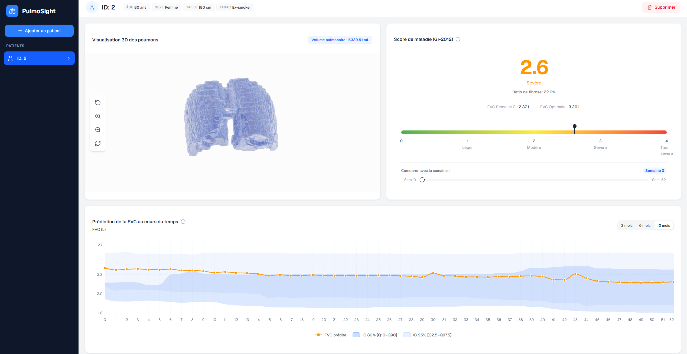
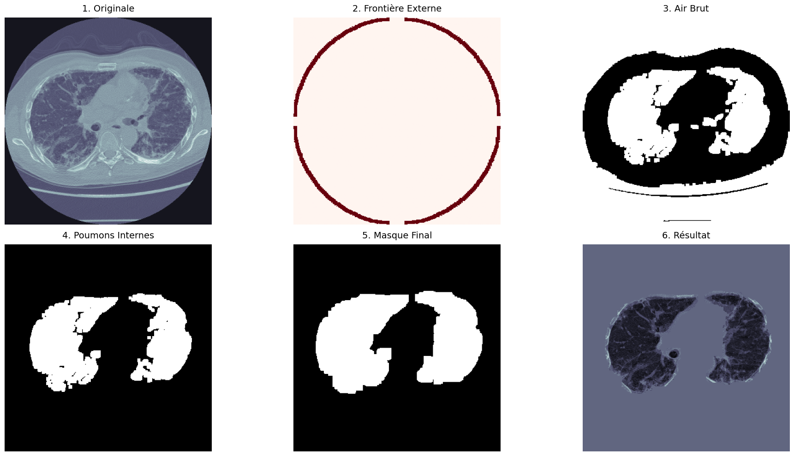
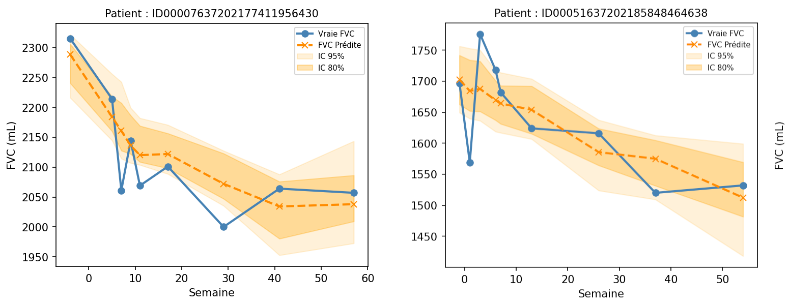
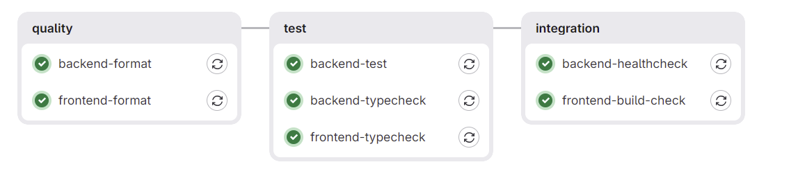

# MedViz SAE Project

MedViz est une application de visualisation et d'analyse de données médicales (conversion DICOM vers 3D, prédiction de la FVC). Le projet comprend un backend en Python (FastAPI) pour le traitement d'images et un frontend en Next.js.

## Aperçu de l'interface



## Pipeline de traitement (Segmentation 3D)

Traitement des coupes scanner (CT Scans) pour isoler les structures pulmonaires et les zones d'intérêt.



## Prédictions FVC

Modélisation et prédiction de la Capacité Vitale Forcée (FVC) du patient au fil du temps.



## Architecture et CI/CD

Pipeline de conteneurisation Docker et d'intégration continue.



---

## Démarrage rapide avec Docker

Le projet est entièrement "dockerisé" pour faciliter son déploiement et garantir que l'environnement d'exécution soit identique pour tous.

### Prérequis

- [Docker](https://docs.docker.com/get-docker/) et [Docker Compose](https://docs.docker.com/compose/install/) installés sur votre machine.

### Lancer l'application

Pour démarrer l'application (backend + frontend) en arrière-plan, exécutez la commande suivante à la racine du projet :

```bash
docker compose up --build -d
```

Une fois les conteneurs démarrés :

- Le **Frontend** sera accessible sur : [http://localhost:3000](http://localhost:3000)
- Le **Backend (API)** sera accessible sur : [http://localhost:8000](http://localhost:8000)
- La documentation interactive de l'API (Swagger UI) : [http://localhost:8000/docs](http://localhost:8000/docs)

### Arrêter l'application

Pour stopper les conteneurs de l'application, exécutez :

```bash
docker compose down
```

**Note sur la persistance des données** :
L'application utilise un volume Docker nommé (`medviz_data`) pour stocker la base de données SQLite et les données des patients. Ainsi, vos données sont conservées de manière sécurisée même après un `docker compose down`, et n'interfèrent pas avec vos tests en local.

---

## Origine du projet et migration

Ce projet a été initialement développé dans le cadre académique (EPITA) sur une instance GitLab privée avec GitLab CI. Il a ensuite été migré sur GitHub. L'historique des Merge Requests et l'ensemble des métadonnées d'origine sont conservés dans le fichier [MIGRATION_REPORT.md](MIGRATION_REPORT.md).
